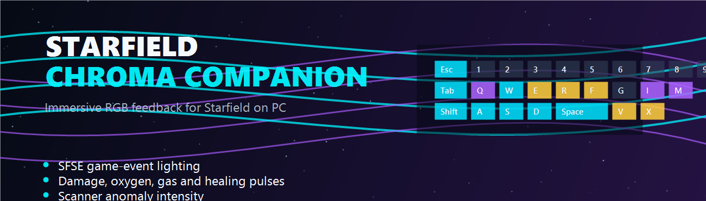
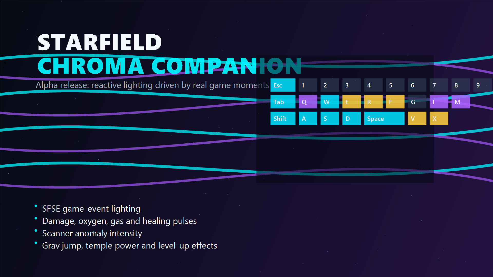

# Starfield Chroma Companion



Reactive Razer Chroma lighting for Starfield, powered by SFSE game events and a small Node.js companion app.

[Download on Nexus Mods](https://www.nexusmods.com/starfield/mods/) · [GitHub releases](https://github.com/michaelstienstra25-sudo/starfield-chroma-companion/releases) · [Report an issue](https://github.com/michaelstienstra25-sudo/starfield-chroma-companion/issues)

This project is currently an early PC-only prototype. It is built for players who run Starfield through SFSE and use Razer Synapse/Chroma devices.



## Quick Start

The easiest way to run the alpha is through the included desktop launcher app:

```cmd
start-tray.cmd
```

Local builds can also use the compiled launcher:

```cmd
StarfieldChromaCompanion.exe
```

From there you can:

- Launch Starfield with one `START STARFIELD` button.
- Keep companion and Starfield status visible from the tray icon.
- Open Settings for brightness, pulse strength, damage thresholds, logging, and your Starfield folder.
- Open Razer Chroma to check the required Chroma Apps setting.
- Open the Advanced Panel for Chroma SDK checks, effect previews, and multi-device focus tests.

## Install With Setup Assistant

The easiest install option for most users is the single-file setup assistant:

```text
StarfieldChromaCompanionSetup-v0.1.4-alpha.exe
```

1. Run `StarfieldChromaCompanionSetup-v0.1.4-alpha.exe`.
2. The setup assistant searches Steam libraries and common install paths for Starfield.
3. If Starfield is not detected, browse to the folder that contains `sfse_loader.exe`.
4. Click `Install`.

The setup assistant installs the companion app to:

```text
%LOCALAPPDATA%\StarfieldChromaCompanion
```

It installs the SFSE plugin DLLs to:

```text
<Starfield folder>\Data\SFSE\Plugins
```

It can create optional Desktop and Windows Start Menu shortcuts. The selected Starfield folder is saved in `starfield-chroma.config.json`, so the launcher works even when Starfield is installed outside the default Steam folder.

A zip-based installer package may also be provided as a fallback for users or mod managers that prefer extracted files.

For manual installs, you can also run:

```cmd
launch-starfield-chroma.cmd
```

The browser control panel is still available as the advanced/debug view:

```cmd
node ".\launcher\starfield-chroma-launcher.mjs"
```

To rebuild the Windows launcher executable after changing the tray app:

```cmd
powershell -NoProfile -ExecutionPolicy Bypass -File ".\tools\build-launcher-exe.ps1"
```

The companion must keep running while Starfield is active. If you launch only `Starfield.exe` or only `sfse_loader.exe`, the RGB effects will not start unless the companion is already running.

## Why Use It?

Starfield Chroma Companion turns your Razer Chroma setup into a reactive cockpit, scanner, combat, and exploration lighting layer. It is tuned around real gameplay moments such as scanner anomalies, damage, oxygen warnings, grav jumps, temple/power moments, and level-up screens.

This is an unofficial community project and is not affiliated with Bethesda, Razer, or Nexus Mods.

## Features

- Reactive keyboard zones for movement, sprint, jump, scanner, interact, reload, quickslots, menus, ship controls, and systems.
- Game-event lighting for weapon fire, reloads, ammo changes, combat, hits, damage, bleedout, radiation/gas, O2 danger, loading, saving, and UI menus.
- Scanner anomaly proximity effect with sustained purple/white glitch lighting while the scanner is active.
- Temple, portal, power, Powers menu, and level-up effects with distinct visual styles.
- Multi-device Chroma support for keyboard, mouse, mousepad, headset, and chromalink devices.
- Custom 9x7 mouse effects for combat, damage, scanner anomalies, grav/power moments, O2/gas warnings, rewards, menus, and idle state.
- Stronger headset, mousepad, and chromalink pulses for damage, combat, scanner, ship, menu, power, and exploration moments.
- Starfield-styled desktop launcher with one `START STARFIELD` button, tray status, settings, and advanced test panel.
- Single-file setup assistant that detects Starfield, installs the companion, installs SFSE plugin DLLs, and creates optional Desktop/Start Menu shortcuts.
- Configurable brightness, damage thresholds, logging, Chroma SDK URL, UDP port, and stale timeout.

## Requirements

- Starfield for PC
- SFSE compatible with your installed Starfield version
- Razer Synapse with Razer Chroma installed
- Razer Chroma Apps enabled in Razer Chroma
- Local Razer Chroma SDK REST service
- Node.js 20 or newer

## Razer Chroma Apps Setup

Razer Chroma must allow Chroma Apps to take over device lighting. If this is off, the SDK can still answer successfully while the keyboard stays on a normal Quick Effect such as Spectrum Cycling.

1. Open `Razer Chroma`.
2. Go to `CHROMA APPS`.
3. Turn the global `CHROMA APPS` toggle on.
4. Make sure `Starfield Chroma Companion` is enabled in the app list.
5. In the companion control panel, click `Register/Test Chroma App` or any test effect.
6. Razer Chroma should show `App in use: Starfield Chroma Companion (Chroma Apps)`.

The control panel includes an `Open Razer Chroma` button and repeats these steps. The app does not modify Razer's internal settings directly because Razer documents Chroma Apps as a user-controlled Synapse/Chroma setting.

## Looking For Testers

This alpha has been tuned on one local setup and needs testing on more Razer Chroma keyboards, mice, mousepads, headsets, and Starfield/SFSE versions. Feedback, bug reports, feature ideas, and short gameplay clips are welcome.

Useful reports include:

- Starfield version and SFSE version.
- Razer device model(s).
- Whether Synapse/Chroma SDK was already running.
- Which in-game effect worked or did not work.
- Screenshots of errors, logs, or quarantine messages.

## Install With Vortex

1. Download the Vortex package from Nexus Mods.
2. Install and enable it with Vortex.
3. Start the control panel from your Starfield Data folder with Node.js:

```cmd
cd /d "C:\Path\To\SteamLibrary\steamapps\common\Starfield\Data\StarfieldChromaCompanion"
node ".\launcher\starfield-chroma-launcher.mjs"
```

4. Click `Start Companion + SFSE`, or start the companion first and then launch Starfield through SFSE.

The Vortex package installs the SFSE plugins to:

```text
Data\SFSE\Plugins\
```

It also installs the companion app to:

```text
Data\StarfieldChromaCompanion\
```

The Vortex package intentionally does not include Windows `.cmd` helper scripts, because some antivirus tools and mod managers flag script files more aggressively. The manual package still includes helper scripts for users who prefer them.

## Install With Mod Organizer 2

MO2 should work, but it needs a slightly different setup because of MO2's virtual file system. Starfield and SFSE see enabled mod files through MO2's VFS. A separately started Node.js process does not automatically see that same virtual `Data` folder unless you launch it through MO2 or point it at the real MO2 mod folder.

The companion does not need to share Starfield's virtual `Data` folder at runtime. The SFSE plugin sends events to the companion over localhost/UDP. The companion mainly needs its own script and config file.

Suggested MO2 flow:

1. Install the clean Vortex package in MO2 and enable it.
2. Add `sfse_loader.exe` as an MO2 executable and launch Starfield through MO2.
3. Add a second MO2 executable for the companion:
   - Binary: `node.exe`
   - Start in: the mod's `StarfieldChromaCompanion` folder inside MO2's mods directory
   - Arguments: `.\mo2-start.mjs`
4. Run the companion entry from MO2.
5. In the control panel, click `Start Companion`.
6. Launch Starfield through SFSE from MO2.

Do not use the control panel's `Start SFSE` button for an MO2-managed playthrough. That button launches `sfse_loader.exe` directly and will not use MO2's virtual file system.

If you launch the companion outside MO2, use the real path to the installed MO2 mod folder, not the virtual Starfield `Data` path. See [docs/MO2_SETUP.md](docs/MO2_SETUP.md) for the shorter MO2-specific setup guide.

## Virus Scan Notes

The Vortex package contains SFSE plugin DLLs. Some antivirus tools and mod managers may flag DLL-based game mods as suspicious until the files gain more reputation or are rescanned. The Vortex package does not include `.cmd`, `.bat`, or `.ps1` helper scripts.

The source code is public in this repository for transparency. If a file is quarantined, review the warning carefully and only restore or allowlist it if you are comfortable running SFSE plugin mods.

## Manual Install From A Release

These instructions are for a normal manual install outside Vortex/MO2. They are not the recommended path for MO2 because MO2 uses a virtual file system.

1. Download the latest release zip.
2. Extract it somewhere outside your Starfield folder.
3. Install the SFSE plugins:

```cmd
install-plugin.cmd "C:\Path\To\SteamLibrary\steamapps\common\Starfield"
```

If Starfield is installed in the default Steam location, you can try:

```cmd
install-plugin.cmd
```

4. Start the control panel:

```cmd
launch-starfield-chroma.cmd
```

5. Click `Start Companion + SFSE`, or use the old direct SFSE helper:

```cmd
launch-starfield-sfse.cmd "C:\Path\To\SteamLibrary\steamapps\common\Starfield"
```

Do not launch `Starfield.exe` directly, or SFSE plugins will not load.

The installer copies both `StarfieldChromaCodex.dll` and `StarfieldChromaProbe.dll` when they are present in the release folder. The probe is used for menu-aware effects such as starmap, powers, temple transitions, and level-up screens.

## Configuration

Edit `starfield-chroma.config.json`:

```json
{
  "brightness": 1,
  "forceRefreshMs": 1000,
  "pulseBoost": 1.45,
  "logEvents": false,
  "accentDevices": true,
  "starfieldDir": "",
  "damageThresholds": {
    "chip": 1,
    "heavy": 25,
    "critical": 150
  }
}
```

Set `logEvents` to `true` only when debugging. `logHeartbeats` is intentionally off by default because it is noisy.

## Current Status

This is not an official Bethesda or Razer project. It is a community-built integration and may need updates when Starfield, SFSE, Synapse, or the Chroma SDK changes.

Known limitations:

- PC-only.
- Requires SFSE.
- Requires the companion app to keep running while the game is active.
- Some game moments are detected through reliable event patterns rather than direct official Starfield APIs.
- This alpha has been tuned on one local setup and still needs broader hardware/game-version testing.
- Multi-device Chroma support is now active for keyboard, mouse, mousepad, headset, and chromalink devices. Hardware behavior can still vary by device model, so reports from Naga-class mice, Razer headsets, mousepads, and Chroma Link setups are especially useful.

## Alpha Highlights

- Scanner anomaly proximity sustain with stronger intensity near active distortions.
- Temple, portal, and power effects through video/loading/menu patterns.
- Grav jump sequence: starmap charge-up, loading warp, and takeoff engine sweep.
- Distinct visual language for level-up, powers, damage, O2/gas, radiation, scanner, reload, combat, and ship moments.

## Build

The repository contains:

- `sfse-plugin/`: main SFSE plugin source.
- `commonlibsf-probe/`: experimental CommonLibSF event probe source.
- `companion/`: Node.js Chroma companion.
- `tools/`: local test event helpers.

Build setup is still being cleaned up for public contributors. For now, release packages are the recommended way to use the project.

The CommonLibSF probe expects `COMMONLIBSF_ROOT` to point to a local CommonLibSF checkout, or a `commonlibsf` folder next to `commonlibsf-probe`.

## License

GPL-3.0-or-later. See `LICENSE`.
